# Brasil EvilPortal HTML Files

Repositório criado com o objetivo de reunir arquivos HTML (telas de coleta) para uso como [**portal captive**](https://en-m-wikipedia-org.translate.goog/wiki/Captive_portal?_x_tr_sl=en&_x_tr_tl=pt&_x_tr_hl=pt&_x_tr_pto=tc) (**Evil Portal**), especificamente adaptados para o contexto brasileiro 🇧🇷.

### Bruce Firmware on M5Stack
As páginas de coleta do repositorio foram testadas usando a ferramenta Bruce na plataforma [**M5stack**](https://m5stack.com/).

<h1 align="center">
  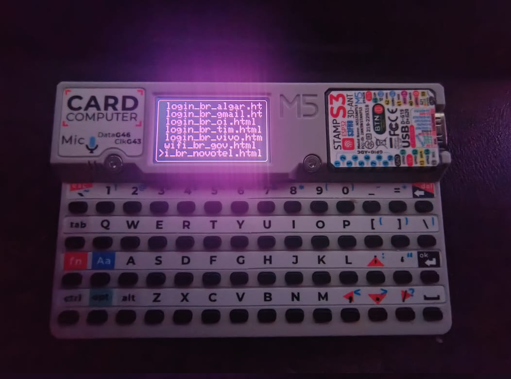
</h1>

Bruce Firmware on M5Stack Cardputer

> Bruce is meant to be a versatile ESP32 firmware that supports a ton of offensive features focusing on facilitating Red Team operations. It also supports m5stack products and works great with Cardputer, Sticks, M5Cores, T-Decks and T-Embeds. Repo: https://github.com/pr3y/Bruce

## AVISO

#### Isenção de Responsabilidade: Uso Educacional e Estrutura Legal
As páginas de coleta fornecidas aqui são estritamente destinadas a fins educacionais e de treinamento. O objetivo é aumentar a conscientização sobre ameaças de segurança e ensinar os usuários a se proteger contra ataques de coleta.
Ao acessar essas páginas, você concorda em usá-las apenas dentro de uma estrutura legal e ética, em conformidade com as leis  e regulamentos aplicáveis em sua jurisdição.

#### Contexto de Estudos Técnicos
As páginas de coleta fornecidas neste repositório têm como objetivo apoiar profissionais de segurança em seus estudos e aprimoramento do cenário de cibersegurança, tudo dentro do contexto de construção de  um ambiente de simulação de ataque e defesa.

#### Limitação de Responsabilidade
O autor desta página se isenta de qualquer responsabilidade pelo uso malicioso ou ilegal dessas páginas de coleta. Qualquer pessoa que use essas páginas para fins não conformes à lei será a única responsável por suas ações. É altamente recomendável nunca usar essas técnicas para qualquer finalidade que não seja aprendizado e conscientização. O autor não monitora o uso dessas páginas após o download e transfere toda a responsabilidade ao usuário após o download.

---

## Páginas de coleta
Recomendo utilizar um **cartão SD de 16GB** para armazenamento de todas as telas.

| SCREENSHOT | SCREENSHOT | SCREENSHOT | SCREENSHOT | SCREENSHOT | SCREENSHOT | 
| -------    | -------    | -------    | -------    | -------    | -------    |
| 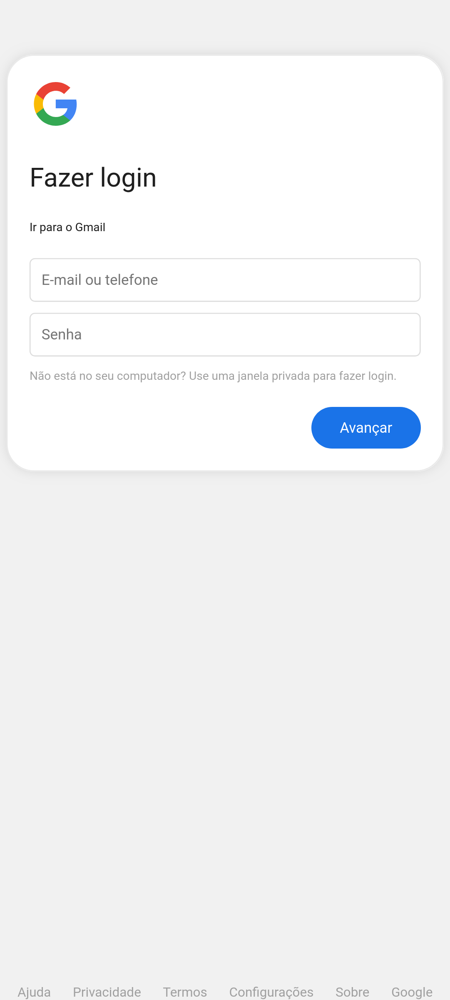  | 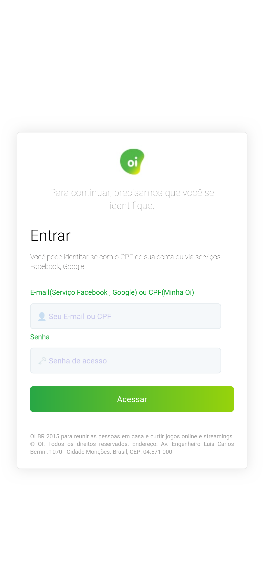 | 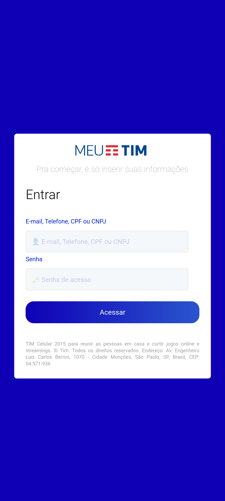 | 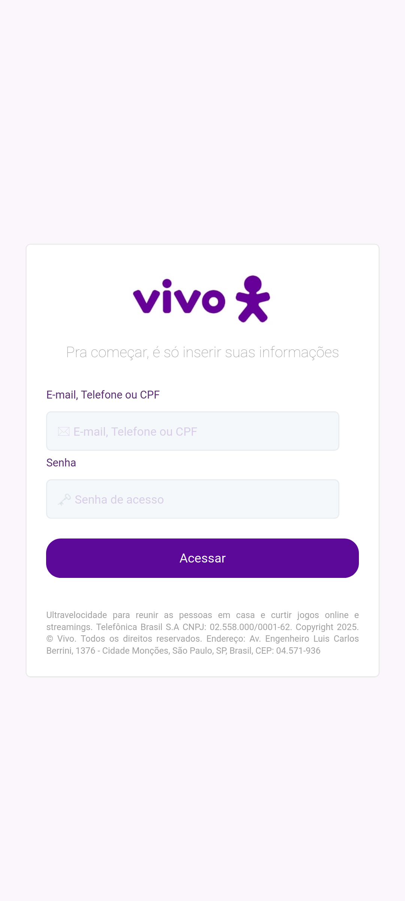 |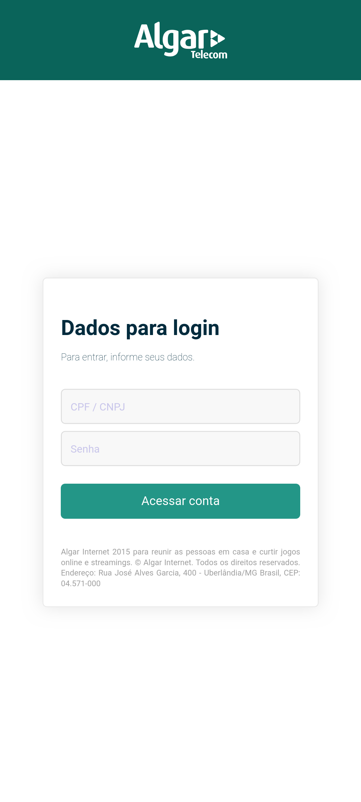 | 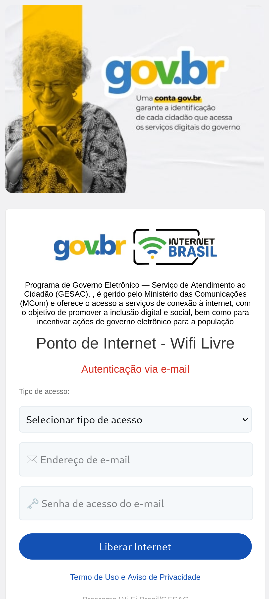  |
| 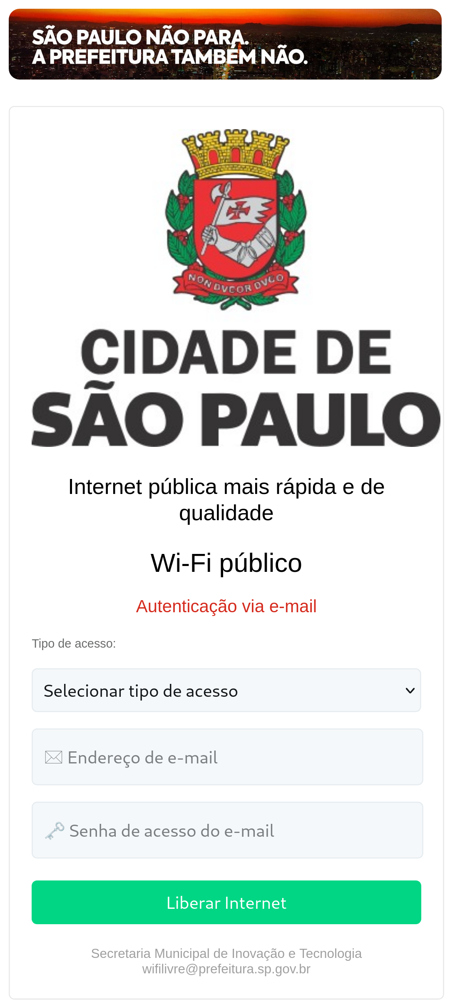 |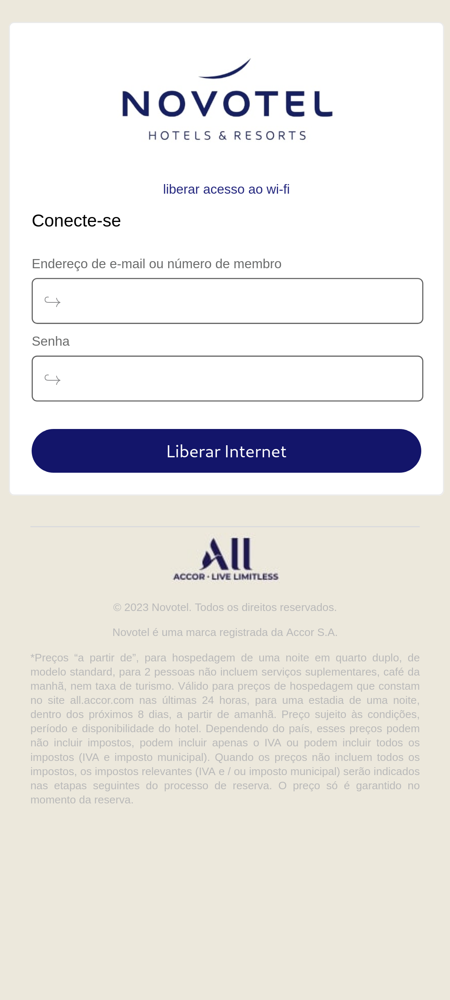 | 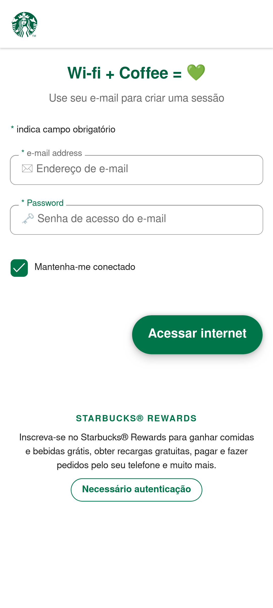 | 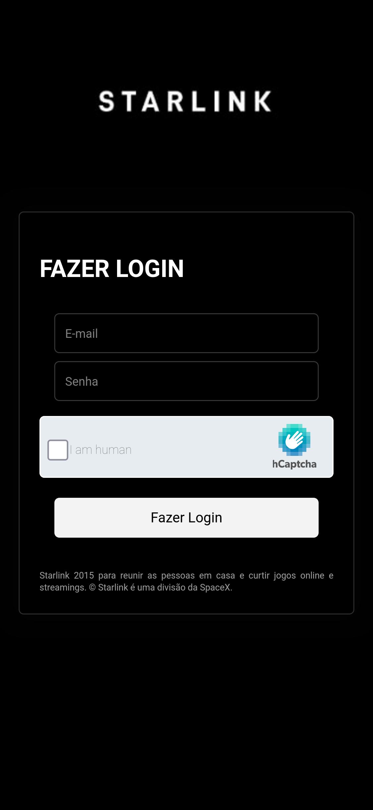 | 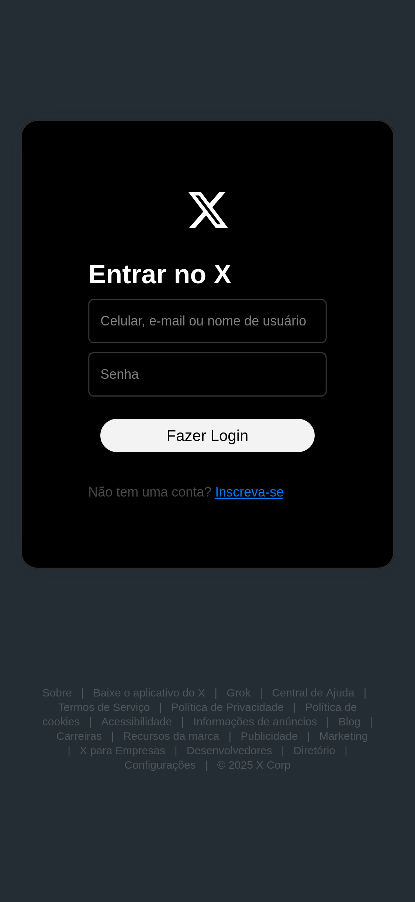 | 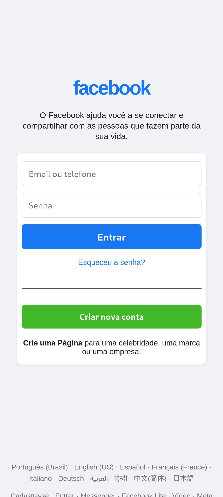 |
| -          |  -         |  -         |  -         |  -         |  -         |

## Template

O arquivo template.html foi criado com base nas melhores práticas e fomentar um padrão para futuras páginas:

<h1 align="center">
  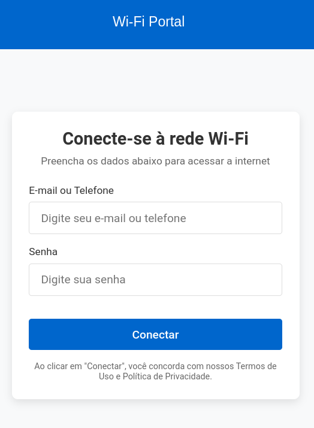
</h1>

1. **Design Responsivo**: Adaptável a diferentes tamanhos de tela
2. **Estrutura Clara**: `HTML` semântico com seções definidas
3. **Estilos Personalizáveis**: Uso de variáveis CSS para fácil personalização
4. **Elementos Essenciais**:
   - Logotipo no cabeçalho
   - Formulário de login com campos de usuário e senha
   - Textos informativos para orientação do usuário
   - Rodapé com informações
5. **Compatibilidade**: Funciona em navegadores modernos sem dependências externas, para imagemns é usado `svg` ou `base64`
6. **Form**: Todos forms seguem padrão enviando request para `/get` do tipo `POST`.
   - Campos do form:
      - usr: para campo login
      - pwd: para campo de senha
      -  tp: para campo tipo de login
      - cpt: para checkbox captcha fake
---

## Autores 👔 

- **Cleiton P. (MrCl0wnLab)** - [Twitter](https://twitter.com/MrCl0wnLab), [Git](https://github.com/MrCl0wnLab), [Blog](https://blog.mrcl0wn.com/)

---

## Contribuições ✨ 
Contribuições de qualquer tipo são bem-vindas!

